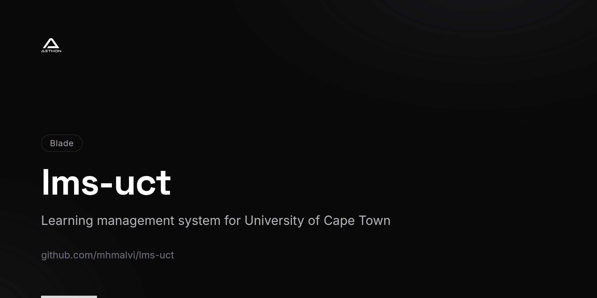

<!-- repo-card -->


# LMS-UCT

A Learning Management System built for the University of Cape Town (UCT) using Laravel 8. The platform provides course management, virtual classrooms, online enrollment with payment processing, calendar scheduling, and PDF certificate generation.

## Features

- **Course Management** -- Create and manage courses with categories, descriptions, and enrollment options
- **Virtual Classrooms** -- Classroom spaces with member management, posts, and file attachments
- **Online Enrollment** -- Student enrollment forms with integrated payment processing
- **Payment Integration** -- Secure payment handling for course fees
- **PDF Generation** -- Automated certificate and document generation using DomPDF
- **Calendar Events** -- Schedule and manage academic events and deadlines
- **News & Notices** -- Publish announcements and news updates for students
- **Role-Based Access** -- Admin panel, API layer, and student-facing interface with granular permissions
- **API Layer** -- RESTful API endpoints for course data and integrations
- **Docker Support** -- Docker Compose configuration for local development with MySQL

## Tech Stack

- **Backend:** PHP 7.3+ / 8.0, Laravel 8
- **Frontend:** Blade templates, Tailwind CSS, Laravel Mix
- **Database:** MySQL
- **Authentication:** Laravel Breeze, Laravel Sanctum
- **PDF Generation:** DomPDF
- **Image Processing:** Intervention Image
- **JWT:** Firebase PHP-JWT
- **Containerization:** Docker, Docker Compose

## Prerequisites

- PHP >= 7.3
- Composer
- MySQL 5.7+
- Node.js & npm
- Docker & Docker Compose (optional)

## Setup

### Standard Setup

1. **Clone the repository**
   ```bash
   git clone https://github.com/mhmalvi/lms-uct.git
   cd lms-uct
   ```

2. **Install dependencies**
   ```bash
   composer install
   npm install
   ```

3. **Configure environment**
   ```bash
   cp .env.example .env
   php artisan key:generate
   ```

4. **Update `.env`** with your database credentials and payment gateway keys.

5. **Run migrations**
   ```bash
   php artisan migrate --seed
   ```

6. **Build frontend assets**
   ```bash
   npm run dev
   ```

7. **Start the development server**
   ```bash
   php artisan serve
   ```

### Docker Setup

```bash
docker-compose up -d
```

This starts the Laravel application on port `80` and MySQL on port `3306`.

## Project Structure

```
app/
  Http/Controllers/
    Admin/       # Admin panel controllers
    Api/         # REST API controllers
    Auth/        # Authentication controllers
  Models/        # Eloquent models (Course, Classroom, Enrollment, Order, etc.)
routes/
  web.php        # Public web routes
  api.php        # API routes
resources/       # Blade views and frontend assets
database/        # Migrations and seeders
```

## License

MIT
